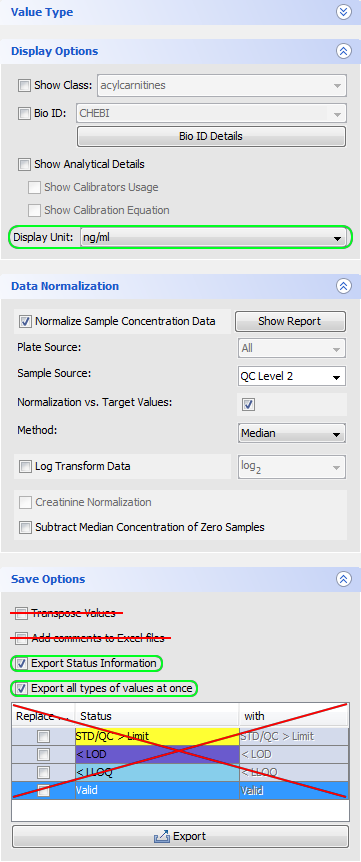

# MeTaQuaC

MeTaQuaC is an R package to facilitate efficient quality control (QC) for targeted metabolomics
analysis with focus on [Biocrates Kits](https://www.biocrates.com/). It provides a simple interface
to create extensive, reproducible and well documented HTML QC reports in an automated fashion.

Please refer to our article to learn more about the underlying ideas of MeTaQuaC:

    Kuhring M. et al., Concepts and Software Package for efficient Quality Control in targeted
    Metabolomics Studies - MeTaQuaC (in preparation)

MeTaQuaC supports the following Biocrates Kits (for the present):

* Biocrates AbsoluteIDQ p400 HR Kit
* Biocrates AbsoluteIDQ Stero17 Kit
* Biocrates MxP Quant 500 Kit


**Note**: Before using MeTaQuaC to create a QC report, please make sure to be familiar with the
Biocrates kit used, i.e. familiarize yourself with the compounds, sample types, status values,
terminology, analytical specification, etc. (please refer to Biocrates' manuals and documents
provided with the kit used).


## Requirements
In general, to run the code please copy and paste the code chunks into your R interface and then
press return.

MeTaQuaC is a package developed and tested with [GNU R](https://www.r-project.org/)
(version >= 3.4.4).

In R, install the ``devtools`` package to enable installation from git repositories:

```r
install.packages("devtools")
```

Other package dependencies (as stated in the [DESCRIPTION](DESCRIPTION) file) should be
resolved automatically during installation.


## Installation
To install and activate the latest release of MeTaQuaC execute the following commands in R:

```r
devtools::install_github("https://github.com/bihealth/metaquac")
library(metaquac)
packageVersion("metaquac")
```


## Execution
The MeTaQuaC package provides one simple function to create an extensive, reproducible and well
documented report. The data for this can be taken directly from Biocrates IDQ software. There are
instructions below on how to do this.

To create the report execute the function `metaquac::create_qc_report` in R, including the relevant
parameters below. An example piece of code and full description of all parameters is provided
further down.

`metaquac::create_qc_report` requires only one obligatory parameter `data_files`, consisting of an R
list of at least one named batch indicating corresponding files per vector, each (e.g.
*list(Batch1 = c("Batch1_LC1.txt", "Batch1_LC2.txt"), Batch2 = c("Batch2_LC1.txt",
"Batch2_LC2.txt"))*). Furthermore, commonly used parameters should include the `kit` (defaults to
"Biocrates AbsoluteIDQ p400 HR Kit") and the `measurement_type` (defaults to "LC").

Always create separate reports for LC and FIA data. Indicating LC and FIA data files within one
report is not recommended nor supported and will result in unexpected behavior including results
difficult to interpret.

Learn more about the available parameters by typing `?metaquac::create_qc_report` into the R
console or see the parameter section below.

**Note**: Depending on the number of compounds per kit and injection as well as the number of
samples in a study, the resulting HTML reports may considerably grow in size due to the extensive
amount of figures and intermediate data provided.

## Examples
To test the QC report creation, the package includes sample data for a Biocrates MxP Quant 500 Kit
with one batch as well for a Biocrates AbsoluteIDQ p400 HR Kit with four batches. The reports for
different kits and injections types can be created by executing the following commands in R.

**Note**: The function `system.file` is only used to extract example data from the MeTaQuaC
package and won't be necessary for regular files.

### Biocrates MxP Quant 500 Kit - LC injection
```r
metaquac::create_qc_report(
  data_files = list(
    Batch1 = c(
      system.file("extdata", "biocrates_q500_test_01/Batch1_LC.txt", package = "metaquac"))),
  kit = "Biocrates MxP Quant 500 Kit",
  measurement_type = "LC",
  title = "Biocrates QC - Q500 - LC",
  report_output_name = "biocrates_qc_q500_lc",
  report_output_dir = "biocrates_q500_test",
  pool_indicator = "Sex",
  profiling_variables = c('Sex'),
  study_variables = list('Sex'),
  replicate_variables = c('Sex')
)
```

### Biocrates MxP Quant 500 Kit - FIA injection
```r
metaquac::create_qc_report(
  data_files = list(
    Batch1 = c(
      system.file("extdata", "biocrates_q500_test_01/Batch1_FIA.txt", package = "metaquac"))),
  kit = "Biocrates MxP Quant 500 Kit",
  measurement_type = "FIA",
  title = "Biocrates QC - Q500 - FIA",
  report_output_name = "biocrates_qc_q500_fia",
  report_output_dir = "biocrates_q500_test",
  pool_indicator = "Sex",
  profiling_variables = c('Sex'),
  study_variables = list('Sex'),
  replicate_variables = c('Sex')
)
```

### Biocrates AbsoluteIDQ p400 HR Kit - LC injection
```r
metaquac::create_qc_report(
  data_files = list(
    Batch1 = c(
      system.file("extdata", "biocrates_p400_test_01/Batch1_LC1.txt", package = "metaquac"),
      system.file("extdata", "biocrates_p400_test_01/Batch1_LC2.txt", package = "metaquac")),
    Batch2 = c(
      system.file("extdata", "biocrates_p400_test_01/Batch2_LC1.txt", package = "metaquac"),
      system.file("extdata", "biocrates_p400_test_01/Batch2_LC2.txt", package = "metaquac")),
    Batch3 = c(
      system.file("extdata", "biocrates_p400_test_01/Batch3_LC1.txt", package = "metaquac"),
      system.file("extdata", "biocrates_p400_test_01/Batch3_LC2.txt", package = "metaquac")),
    Batch4 = c(
      system.file("extdata", "biocrates_p400_test_01/Batch4_LC1.txt", package = "metaquac"),
      system.file("extdata", "biocrates_p400_test_01/Batch4_LC2.txt", package = "metaquac"))),
  kit = "Biocrates AbsoluteIDQ p400 HR Kit",
  measurement_type = "LC",
  title = "Biocrates QC - p400 - LC",
  report_output_name = "biocrates_qc_p400_lc",
  report_output_dir = "biocrates_p400_test",
  pool_indicator = "Sample.Identification",
  profiling_variables = c("Group", "Condition"),
  study_variables = list("Group", "Condition", "Group" = list("Condition")),
  replicate_variables = c("Group", "Condition")
)
```

### Biocrates AbsoluteIDQ p400 HR Kit - FIA injection
```r
metaquac::create_qc_report(
  data_files = list(
    Batch1 = c(
      system.file("extdata", "biocrates_p400_test_01/Batch1_FIA1.txt", package = "metaquac"),
      system.file("extdata", "biocrates_p400_test_01/Batch1_FIA2.txt", package = "metaquac")),
    Batch2 = c(
      system.file("extdata", "biocrates_p400_test_01/Batch2_FIA1.txt", package = "metaquac"),
      system.file("extdata", "biocrates_p400_test_01/Batch2_FIA2.txt", package = "metaquac")),
    Batch3 = c(
      system.file("extdata", "biocrates_p400_test_01/Batch3_FIA1.txt", package = "metaquac"),
      system.file("extdata", "biocrates_p400_test_01/Batch3_FIA2.txt", package = "metaquac")),
    Batch4 = c(
      system.file("extdata", "biocrates_p400_test_01/Batch4_FIA1.txt", package = "metaquac"),
      system.file("extdata", "biocrates_p400_test_01/Batch4_FIA2.txt", package = "metaquac"))),
  kit = "Biocrates AbsoluteIDQ p400 HR Kit",
  measurement_type = "FIA",
  title = "Biocrates QC - p400 - FIA",
  report_output_name = "biocrates_qc_p400_fia",
  report_output_dir = "biocrates_p400_test",
  pool_indicator = "Sample.Identification",
  profiling_variables = c("Group", "Condition"),
  study_variables = list("Group", "Condition", "Group" = list("Condition")),
  replicate_variables = c("Group", "Condition")
)
```


## MetIDQ Data Export
The data needed for the QC report is directly exported from Biocrates' MetIDQ software.

1. After acquisition and processing with MetIDQ switch to the `MetSTAT` module (please refer to
   Biocrates' manuals and documents provided with the kit used to infer the relevant steps for your
   data).
2. Select your project and samples (including at least biological, QC and calibration
   standards samples) so they show up under the `Display Data` - `Data` tab.
3. Data normalization may be applied as described in the MetIDQ manual.
4. In the `Save Options` section, **select** `Export Status Information` and `Export all types of
   values at once`. Do **not** select `Transpose Values` and `Add comments to Excel files` nor
   enable the replacement of any values!
5. Press `Export` and save the data as tab-separated text file.
6. Repeat the export for all corresponding injection types and batches (watch out for a
   **consistent** `Display Unit` between batches).

The necessary settings are additionally highlighted in the figure below.




## Parameters
Currently, QC report creation is controlled by the one main function of the MeTaQuaC package,
`create_qc_report`. The following parameters of the function are available to customize the report:

* `data_files` Data files as exported by MetIDQ (txt), indicated as an R list providing the
files per batch via named vectors. E.g. list(Batch1 = c("Batch1_LC1.txt", "Batch1_LC2.txt"),
Batch2 = c("Batch2_LC1.txt","Batch2_LC2.txt")).
* `kit` The Biocrates Kit used to create the data to import. Currently supported are
"Biocrates AbsoluteIDQ p400 HR Kit", "Biocrates MxP Quant 500 Kit" and
"Biocrates AbsoluteIDQ Stero17 Kit" (default = "Biocrates AbsoluteIDQ p400 HR Kit").
* `measurement_type` The measurement type (i.e. injection type) of the data to import, i.e.
either "LC" or "FIA" (default = "LC").
* `title` Custom title for report (default = "Biocrates QC Report").
* `author` Name of the person responsible for creating the report (default = system user).
* `report_output_name` Custom name of report file (default =
"YYYYMMDD_HHMMSS_qc_report_{LC|FIA}").
* `report_output_dir` Custom path of an output directory (default = "reports").
* `pool_indicator` Indicate a column/variable name which should be scanned for pooled QC samples.
(default = "Sample Identification", set NULL to disable). All samples containing "pool" (case
insensitive) anywhere in this variable's values are transformed to Sample Type = "Pooled QC".
* `profiling_variables` Indicate a vector of study variables of interest which will be
used for profiling group sizes (i.e. number of samples) within a variable but also the size of
group intersections between these variables. It is recommended to keep the variables limited to
factors of primary interest (for instance disease status or treatment and sex), otherwise
intersections might end up rather small.
* `study_variables` Indicate a list (actual R list!) of study variables of interest.
These will be used to create group-colored versions of some plots to illustrate group
differences. Nested variables are possible by including named sublists, whereby plots
will be created recursively based on data filtered by groups in the list-naming variable.
* `replicate_variables` Indicate a vector of study variables which donate the unique
grouping of samples (could be as simple as a patient identifier or several conditions)
Samples with the same characteristic in these variables are considered as replicates
for compound and class \%RSD analysis plots. If the data contains "BR" and "TR" columns
these plots will be extended for technical replicates.
* `preproc_keep_status` Indicate which values are acceptable for processing with
respect to Biocrates statuses. The default includes only "Valid" measurements, the rest
is discarded (i.e. transformed to missing values, set to NA). Possible statuses to select from
include "Valid", "Smaller Zero", "< LOD", "< LLOQ", "> ULOQ", "No Intercept",
"Missing Measurement", "ISTD Out of Range", "STD/QC < Limit", "STD/QC > Limit",
"Invalid", "Incomplete" and "Blank Out of Range".
* `filter_compound_qc_max_mv_ratio` Set maximum ratio of missing values allowed for compounds
in reference QC samples (Biocrates' QC Level 2) (default = 0.3, exclusive, disable with NULL).
* `filter_compound_qc_max_rsd` Set maximum \%RSD allowed for compounds in reference QC
samples (Biocrates' QC Level 2) (default = 15\%, exclusive, disable with NULL).
* `filter_compound_bs_max_mv_ratio` Set maximum ratio of missing values allowed for compounds
in biological samples (Biocrates' Sample) (default = 0.3, exclusive, disable with NULL).
* `filter_compound_bs_min_rsd` Set minimum \%RSD allowed for compounds in biological samples
(default = 15\%, exclusive, disable with NULL).
* `filter_sample_max_mv_ratio` Set maximum ratio of missing values allowed per biological
sample (Biocrates' Sample) (default < 0.2, exclusive, disable with NULL).
* `data_tables` Control data tables availability in reports. "all" (default) will show all
implemented data tables (with vcs export buttons). "stats" will only show tables of summarized
data (such as countings, %RSDs, etc.), but not the actual measurements (neither original nor
pre-processed). "none" will show no data tables at all, i.e. the report is mainly limited to
visualizations.
* `metadata_import` Indicate a tab-separated text file with additional
metadata/annotations to import and merge (by column "Sample Identification").
* `metadata_import_overlap` Specify the handling of overlaping columns.
"rename" (default) will extend duplicate column names in the metadata import
with ".D" to make them unique, where D is an increasing number according to the
occurance of the same name. Keep this in mind when indicating variables.
"replace" will replace original columns with new metadata columns.
"omit" will keep original columns and ignore new metadata columns.
* `metadata_name_mods_org` Rename columns in the original data.
This is applied **before** the import the of additional metadata, if any.
Consider that non-unique column names are modified in general. Names not in
the data are ignored. Use a named vector to indicate columns to rename, e.g.:
c(oldname1 = "newname1", oldname2 = "newname2", ...)
* `metadata_name_mods_add` Rename columns in original and added metadata.
This is applied **after** the import of additional metadata, if any. Consider
that non-unique column names are modified in general. Names not in the data
are ignored. Use a named vector to indicate columns to rename, e.g.:
c(oldname1 = "newname1", oldname2 = "newname2", ...)
* `metadata_value_mods` Batch change values in the data, e.g. to correct
sample identifiers, groups, etc. This is applied after metadata import and
renaming, if any. Indicated columns and values not in the data are ignored.
Use a named list, with names indicating the columns and named vectors
indicate the changes to apply, e.g.:
list("columnX" = c("oldvalueA" = "newvalueA", "oldvalueB" = "newvalueB"),
"columnY" = c("1" = 5, "3" = 6, ...), ...)
* `lowcon_conditions` Indicate a vector of study variables of interest
which will be applied to additional reproducibility analysis designed for low
concentration data below the limit of quantification. Hence, this analysis
is performed on completely unfiltered data using area (LC) or intensity (FIA),
resp.
* `lowcon_scatter_x` Indiciate one study variable to be used for the
x-axis in the scatter plot of the additional reproducibility analysis.
This variable must be available in the conditions. If none is given,
the first study variable in the conditions
* `lowcon_scatter_color` Indiciate one study variable to be used for
coloring samples in the response scatter plot of the additional
reproducibility analysis. This variable must be available in the conditions.
If none is given, the first study variable in the conditions
* `lowcon_scatter_sub_groups` Indicate pairs of study variables and
corresponding groups in a named vector to be used for separate response
scatter plots (e.g. if experiments havn't been separated before). By default,
the scatter plot is not separated.


## General Notes on Biocrates Data

* For the Biocrates AbsoluteIDQ p400 HR Kit, MetIDQ may export data without columns for specific
compounds, if no data was acquired in any of the samples. This might not be the case for all
batches of a multi-batch experiment/study. Integrating such batches might result in wrong
calculations and conclusions for instance with respect to numbers and ratios of missing values.
Thus, MeTaQuaC will complement these missing compounds (i.e. basically add a column of missing
values for these compounds). The selection of the kit (p400) as well as the injection type (LC or
FIA) is relevant to know which set of compounds need to be used for completion.
